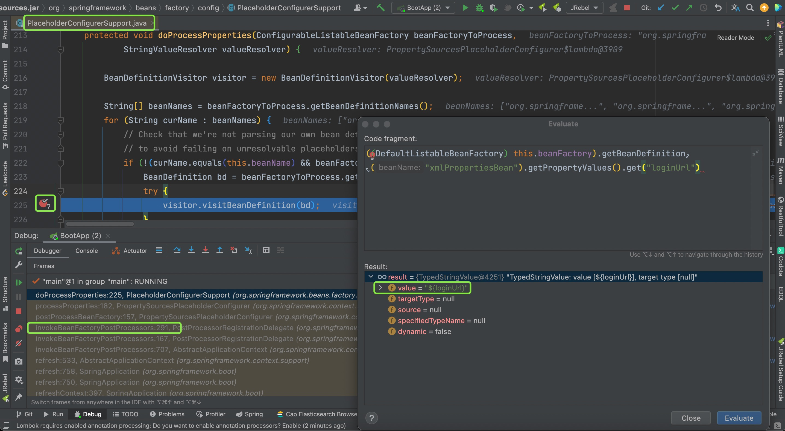
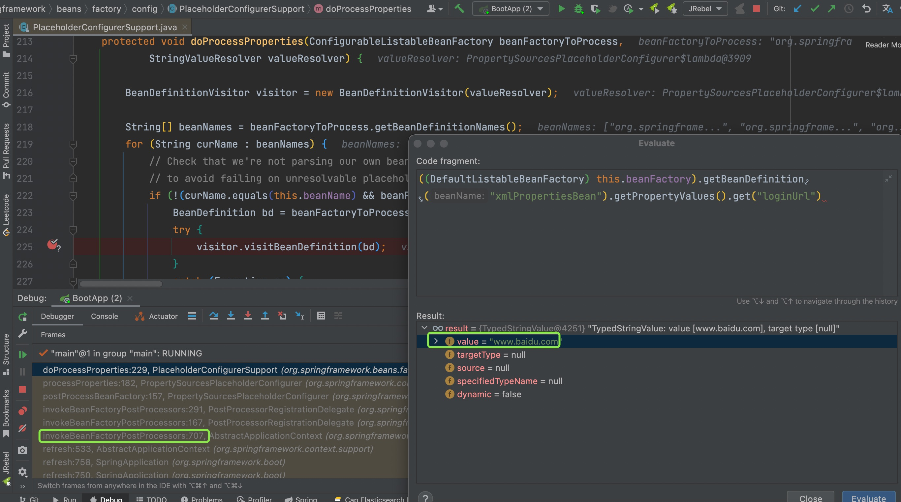

BeanFactoryPostProcessor接口

bean工厂后置处理器,在bean创建之前，对bean工厂里的BeanDefinition对象进行加工处理，例如解释propertyValues属性

```xml
<bean id="xmlPropertiesBean" class="com.XmlPropertiesBean">
    <property name="loginUrl" value="${loginUrl}"></property>
</bean>
```

对${loginUrl}的解释替换工作由**PropertySourcesPlaceholderConfigurer**类完成。下面进入debug模式，验证解析过程。

首先在类**PlaceholderConfigurerSupport**的**doProcessProperties**方法的visitor.visitBeanDefinition(bd);所在行打上断点，并设置断点的条件**"xmlPropertiesBean".equals(curName)**，如下图
<!--more-->



在断点处进行Evaluate执行代码，查看xmlPropertiesBean的loginUrl属性值，可以发现，该值还未替换。此时还没执行完PlaceholderConfigurerSupport后置处理器，接着F8单步执行完visitor.visitBeanDefinition(bd);该行代码，再观察xmlPropertiesBean的loginUrl属性值为www.baidu.com如下图




**visitor.visitBeanDefinition访问者模式**

注意注解@Value("${loginUrl}")并不是由BeanFactoryPostProcessor解析的,下面的Value注解源码，可以看出@Value是AutowiredAnnotationBeanPostProcessor解释的。也就是由BeanPostProcessor处理的，和Autowired一样。

```java
package org.springframework.beans.factory.annotation;

import java.lang.annotation.Documented;
import java.lang.annotation.ElementType;
import java.lang.annotation.Retention;
import java.lang.annotation.RetentionPolicy;
import java.lang.annotation.Target;

/**
 * Annotation used at the field or method/constructor parameter level
 * that indicates a default value expression for the annotated element.
 *
 * <p>Typically used for expression-driven or property-driven dependency injection.
 * Also supported for dynamic resolution of handler method arguments &mdash; for
 * example, in Spring MVC.
 *
 * <p>A common use case is to inject values using
 * <code>#{systemProperties.myProp}</code> style SpEL (Spring Expression Language)
 * expressions. Alternatively, values may be injected using
 * <code>${my.app.myProp}</code> style property placeholders.
 *
 * <p>Note that actual processing of the {@code @Value} annotation is performed
 * by a {@link org.springframework.beans.factory.config.BeanPostProcessor
 * BeanPostProcessor} which in turn means that you <em>cannot</em> use
 * {@code @Value} within
 * {@link org.springframework.beans.factory.config.BeanPostProcessor
 * BeanPostProcessor} or
 * {@link org.springframework.beans.factory.config.BeanFactoryPostProcessor BeanFactoryPostProcessor}
 * types. Please consult the javadoc for the {@link AutowiredAnnotationBeanPostProcessor}
 * class (which, by default, checks for the presence of this annotation).
 *
 * @author Juergen Hoeller
 * @since 3.0
 * @see AutowiredAnnotationBeanPostProcessor
 * @see Autowired
 * @see org.springframework.beans.factory.config.BeanExpressionResolver
 * @see org.springframework.beans.factory.support.AutowireCandidateResolver#getSuggestedValue
 */
@Target({ElementType.FIELD, ElementType.METHOD, ElementType.PARAMETER, ElementType.ANNOTATION_TYPE})
@Retention(RetentionPolicy.RUNTIME)
@Documented
public @interface Value {

	/**
	 * The actual value expression such as <code>#{systemProperties.myProp}</code>
	 * or property placeholder such as <code>${my.app.myProp}</code>.
	 */
	String value();

}
```

