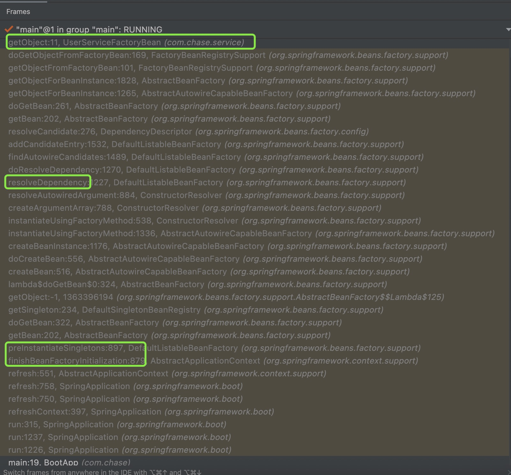

## Factorybean是什么？

factorybean是spring的一个接口类，是spring的一个扩展点之一。先来看一下具体的用法吧，不多说，上代码。源码

创建一个普通的类UserService，注意这个类没加任何注解。[代码链接](https://github.com/caiyl/cai.git)

<!--more-->

```java
package com.chase.service;

import lombok.extern.slf4j.Slf4j;

/**
 * @author chase
 * @date 2023/2/24 4:21 PM
 */
@Slf4j
public class UserService {
    public void test(){
       log.info("test");
    }
}
```

创建一个依赖了UserService的类

```java
package com.chase.service;

/**
 * @author chase
 * @date 2023/3/3 3:03 PM
 */
public class LoginService {
    private UserService userService;

    public LoginService(UserService userService) {
        this.userService = userService;
    }
}

```

创建一个实现了FactoryBean接口的类，并重写**T getObject() throws Exception;**和**Class<?> getObjectType();**两个方法,注意该类加了注解@Service

```java
package com.chase.service;

import lombok.extern.slf4j.Slf4j;
import org.springframework.beans.factory.FactoryBean;
import org.springframework.stereotype.Service;

/**
 * @author chase
 * @date 2023/2/24 4:21 PM
 */
@Slf4j
@Service
public class UserServiceFactoryBean implements FactoryBean<UserService> {

    @Override
    public UserService getObject() throws Exception {
        log.info("创建UserService对象");
        return new UserService();
    }

    @Override
    public Class<?> getObjectType() {
        return UserService.class;
    }
}


```

启动spring

```java
package com.chase;

import com.chase.service.LoginService;
import com.chase.service.UserService;
import com.chase.service.UserServiceFactoryBean;
import org.springframework.boot.SpringApplication;
import org.springframework.boot.autoconfigure.SpringBootApplication;
import org.springframework.context.ApplicationContext;
import org.springframework.context.annotation.Bean;

/**
 * @author chase
 * @date 2023/2/24 4:20 PM
 */
@SpringBootApplication
public class BootApp {
    public static void main(String[] args) {

        ApplicationContext applicationContext = SpringApplication.run(BootApp.class, args);


        Object bean = applicationContext.getBean("userServiceFactoryBean");
        System.out.println("bean userServiceFactoryBean instanceof UserServiceFactoryBean:"+(bean instanceof UserServiceFactoryBean));
        System.out.println("bean userServiceFactoryBean instanceof UserService:"+(bean instanceof UserService));

        Object bean1 = applicationContext.getBean("&userServiceFactoryBean");
        System.out.println("&userServiceFactoryBean instanceof UserServiceFactoryBean:"+(bean1 instanceof UserServiceFactoryBean));
        System.out.println("&userServiceFactoryBean instanceof UserService:"+(bean1 instanceof UserService));


    }

    @Bean
    public LoginService getLoginService(UserService userService) {
        return new LoginService(userService);
    }
}

```


**通过UserServiceFactoryBean创建了UserService对象的bean**。

**什么时候调用FactoryBean的getObject创建对象？**

从控制台打印的结果可以看出，在spring容器启动完成前，会调用getObject方法，创建对象。一定是这样吗。下面我们注释一下以下代码，再跑一次

```java
//    @Bean
//    public LoginService getLoginService(UserService userService) {
//        return new LoginService(userService);
//    }
```


为什么是spring容器启动完了才创建对象呢？在getObject方法入口处打个断点，看下堆栈信息如下


由此可见spring容器启动不会创建对象，当你需要用到factorybean里的对象是，才会进行初始化对象。再放开上面的代码注释，打个断点执行观察如下图



**上图可以看出在spring容器启动初始化阶段，由于创建LoginService类的bean需要userService，所以spring会去容器内部通过getBean获取UserService对象，发现不存在UserService对象时，找到能创建UserService对象的FactoryBean对象创建。** 总结一下**需要才创建**

**直接在UserService类加@Service注解不是更香吗，为什么要有这个骚操作创建对象**

假如要创建的对象很复杂，假如bean对象没有实现类呢，有没有那些地方用到了这个Factorybean值得学习的呢？当然有，要不然不就白白浪费了。其中大名鼎鼎的mybaits，还有spring cloud家族的OpenFeign都用到了。


这两个factoryBean都是利用动态代理生产代理类，交给spring容器管理。