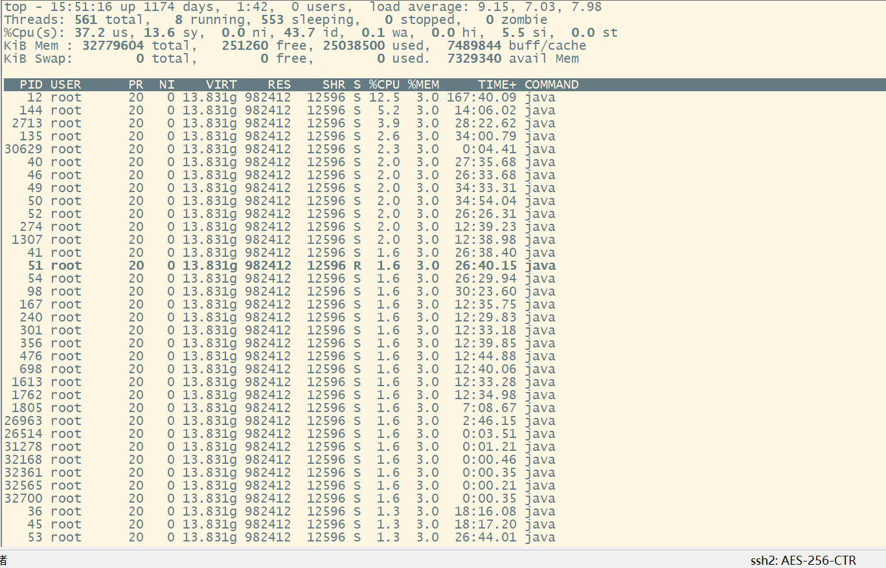

# 背景：

某天其他部门的同事说，我负责的某个服务cpu占用很高，影响到他们的应用。我在想服务不是部署在容器里吗，不是资源隔离的吗，找了运维同事说，cpu确实没用限制。好吧，只能去分析原因了，否则影响到公司其他赚钱的业务系统就麻烦，处于责任心，和对技术的追求，决定还是处理一下。

思路，根据经验，老夫信心满满，内存问题，泄露，溢出，首先是dump出来，Memory Analyzer Tool工具分析。cpu问题，看线程，死循环，100%cpu？大题思路是没有变的，开始表演。

第一步，当然是找运维大佬，jstack pid 导出线程栈信息。然后top -H -p <pid> 查看线程那些线程占用高的。线程栈信息文件到手，top -H -p <pid>信息截图如下



看到这个图，心中万马奔腾，怎么和自己想的不一样，不是有线程名称吗，也没有cpu占用特别高的线程啊，怎么办呢。

再仔细观察图，发现总共有561个线程，只有8个是running,553个是sleep状态。这里就十分奇怪了。到导出的线程栈文件看看那些线程是sleeping吧，没发现太多的线程sleeping，但是发现了很多是TIMED_WAITING状态，如下图


仔细看发现是httpclient导致线程阻塞，突然想到项目中有大量的数据同步请求，是使用httpclient连接池实现的。问题就处在连接池身上。去看看连接池的配置

```java
	private static int defaultMaxConnection = 50;

	/**
	 * 
	 */
	private static PoolingHttpClientConnectionManager cm = new PoolingHttpClientConnectionManager();

	static {
		cm.setMaxTotal(100);
		cm.setDefaultMaxPerRoute(defaultMaxConnection);
	}

	public static CloseableHttpClient getHttpClient() {

		return HttpClients.custom().setConnectionManager(cm).build();

	}
```

最大100个并发，单个通道最大是50。。。。。。仔细想想业务中，有好几百个线程在不断地进行上游数据同步。线程获取不到httpclient链接，各个线程都在竞争获取链接，导致线程阻塞。根据实际情况修改成300个。

# 模拟验证

首先需要模拟一个上游http服务，这里使用interfake模拟。

安装 npm install interfake -g

创建文件，内容如下

```
[
    {
        "request": {
            "url": "/hello",
            "method": "get"
        },
        "response": {
            "code": 200,
            "delay":200,
            "body": {
                "say": "hello world!"
            }
        }
    },
    {
        "request": {
            "url": "/hello2",
            "method": "post"
        },
        "response": {
            "code": 200,
            "delay": 100,
            "body": {
                "theTime": "Adventure Time!"
            }
        }
    }
]
```

然后启动 ：interfake -p 3001 --file ./adventuretime.json

get访问 http://localhost:3001/hello， 模拟延时200

返回

```
{
    "say": "hello world!"
}
```


测试代码

```
package com.util;


import org.apache.http.HttpStatus;
import org.apache.http.client.config.RequestConfig;
import org.apache.http.client.methods.CloseableHttpResponse;
import org.apache.http.client.methods.HttpGet;
import org.apache.http.impl.client.CloseableHttpClient;
import org.apache.http.impl.client.HttpClients;
import org.apache.http.impl.conn.PoolingHttpClientConnectionManager;
import org.apache.http.util.EntityUtils;
import org.slf4j.Logger;
import org.slf4j.LoggerFactory;

import java.util.Date;
import java.util.HashMap;
import java.util.Map;

public class HttpClientUtils {

	private static Logger logger = LoggerFactory.getLogger(HttpClientUtils.class);
	private static int defaultConnectionTimeout = 60000;
	private static int defaultSoTimeout = 60000;
	private static int defaultMaxConnection = 50;
	private static PoolingHttpClientConnectionManager cm = new PoolingHttpClientConnectionManager();

	static {
		cm.setMaxTotal(100);
		cm.setDefaultMaxPerRoute(defaultMaxConnection);
	}

	public static CloseableHttpClient getHttpClient() {

		return HttpClients.custom().setConnectionManager(cm).build();

	}

	public static String doGet(String url, Map<String, String> headers) {

		long startTime = System.currentTimeMillis();

		HttpGet httppost = null;

		try {

			CloseableHttpClient httpclient = getHttpClient();

			httppost = new HttpGet(url);
			httppost.setConfig(RequestConfig.custom().setConnectionRequestTimeout(defaultConnectionTimeout)
					.setConnectTimeout(defaultConnectionTimeout).setSocketTimeout(defaultSoTimeout).build());

			if (headers != null && headers.size() > 0) {
				for (Map.Entry<String, String> entry : headers.entrySet()) {
					httppost.addHeader(entry.getKey(), entry.getValue());
				}
			}

			CloseableHttpResponse response = httpclient.execute(httppost);

			int statusCode = response.getStatusLine().getStatusCode();

			if (statusCode == HttpStatus.SC_OK) {
				return EntityUtils.toString(response.getEntity(), "GBK");
			} else {
				logger.warn("doPost failed: " + EntityUtils.toString(response.getEntity()));
			}

		} catch (Exception e) {
			logger.error("url:{},",url,e);
		} finally {
			if (httppost != null) {
				httppost.releaseConnection();
			}
			if (logger.isDebugEnabled()) {
				logger.debug("execute:{},used time:{}ms " ,url,(System.currentTimeMillis() - startTime));
			}

		}

		return null;
	}

	public static void main(String[] args) {
		for (int i = 0; i < 300; i++) {
			Thread thread = new Thread(new Runnable() {
				@Override
				public void run() {
					while (true){
						String s = HttpClientUtils.doGet("http://localhost:3001/hello", new HashMap<>());
						System.out.println(s+new Date());
					}
				}
			});
			thread.setName("requestThread"+i);
			thread.start();
		}
	}


}

```

线程统计


修改连接池配置 *defaultMaxConnection* 为 200 和 *cm*.setMaxTotal(200);

再重新测试观察如下图


由此可以得出结论，合理配置httpclient连接数很重要。

最后分析一下，在本次排查问题中学到的一些知识，由于本次的线程都是有spring rabbitmq的消费监听创建的，其实这些消费线程是使用线程池处理的，这些线程池已经做了自动缩容，扩容处理，一般不建议另外新旧线程消费处理。具体代码可以去看SimpleMessageListenerContainer类的considerStoppingAConsumer方法和adjustConsumers方法。

# 另外分析一个线程在线分析网站

 [java线程分析网站](https://fastthread.io/)


